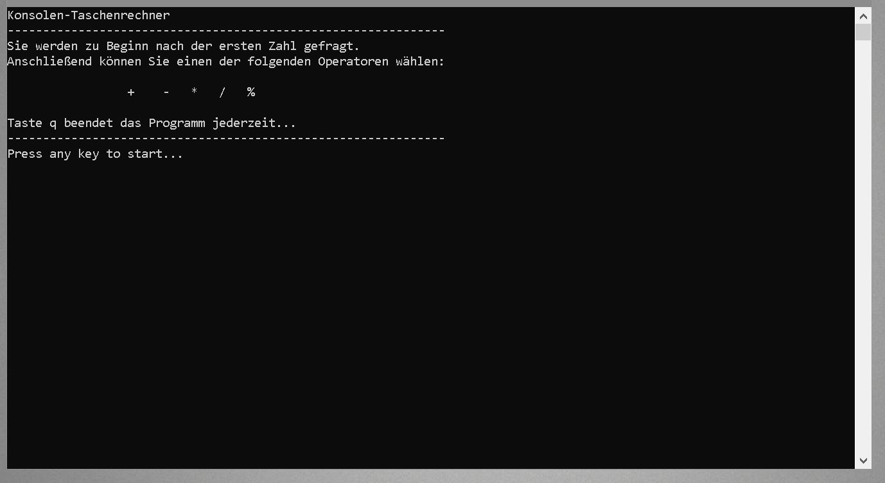

# Console Calculator
> Quickly calculate the result of two numbers using various operators on the console. Just leave the console open with the program running and you can always use the calculator if you need it.

Enter the first number, then the desired operator. Enter the second number and you will be shown the result of the operation. Operators are +, -, *, /, %.




## Execute

Windows:

```csharp
Calculator.exe
```

or

```csharp
Visual Studio: Start "Calculator.Program" Program.cs SHIFT + F5
```


## **Technologies**

Created with

- [ ] Microsoft Visual Studio 2017
- [ ] .NET Core 2.1

Programming language:

- [ ] C#

Application style:

- [ ] Console

  

## Release History

* 1.2
  
    * FIX: Inserted amazing logic in validating user input (Thanks @Konstantin Golovnenkov)
* 1.1
  
    * UPDATE: implemented operator Modulo
* 1.0
  
    * Work in progress
    
      

## Meta

Marcus Greiner – marcusGreiner@ITsmus.de

[https://github.com/velotist/Calculator](https://github.com/dbader/)

